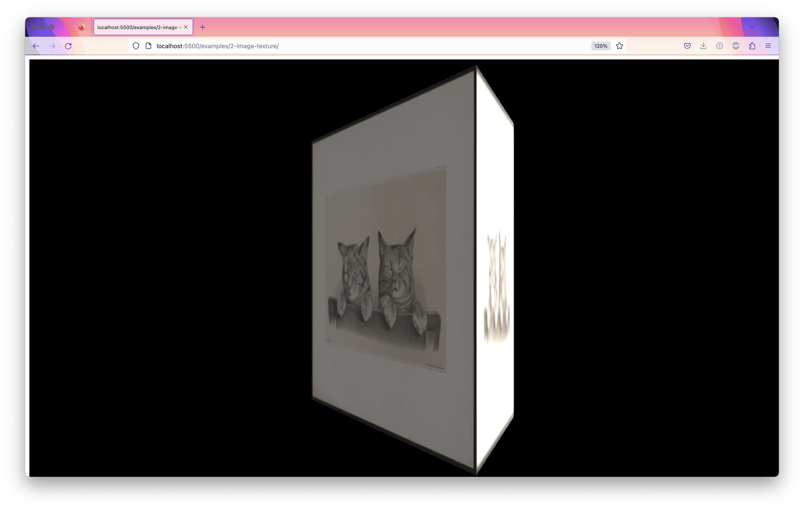

# Real Time Social Spaces

Examples for the Real-Time Social Spaces courses for NYU's Interactive Telecommunications Program.

To start these examples, use the VSCode LiveServer extension and press "Go Live". In your browser, navigate to the address `http://localhost:5500/examples/` and click on any of the examples.

## Week 1

### Examples:

- [Basic Setup](./examples/01-basic-scene/) - this scene implements a three.js scene, camera and renderer along with a 3D object
- [Render Loop](./examples/01-render-loop/) - this scene uses window.requestAnimationFrame to implement a draw loop

## Week 2

### Examples:

- [Lights](./examples/02-lights/) - this scene adds lights and uses a Phong material which is affected by lights
- [Shadows](./examples/02-textures/) - this scene uses lights and shadows
- [Image Textures](./examples/02-image-texture/) - this scene uses an image file as a texture on a 3D object
- [Video Textures](./examples/02-video-texture) - this scene uses a `<video>` element as a texture on a 3D object

### Links:

- [Import Syntax](https://threejs.org/docs/index.html?q=in#manual/en/introduction/Installation) - see section header **Install from CDN or static hosting** for more info on using three.js as a module
- [Mozilla Developer Network (MDN) on Javascript Modules](https://developer.mozilla.org/en-US/docs/Web/JavaScript/Guide/Modules)
- [Loading Image Textures](https://threejs.org/docs/index.html?q=texturel#api/en/loaders/TextureLoader)

## Week 3

### Examples

- [Using Addons](./examples/03-using-addons/) - this scene introduces the ecosystem of THREE's 'addons' in the index.html file and organizes the javascript into an `init()` function
- [Groups and Parenting](./examples/03-groups-and-parenting/) - this scene creates a bird with flapping wings through the use of groups and parenting
- [Backgrounds](./examples/03-backgrounds/) - this scene shows 2 ways of making backgrounds, by adding a 'clear color' to the renderer, and through the use of an equirectangular image

### Links:

- [Transform Hierarchy](https://threejs.org/manual/#en/scenegraph) - More on parent-child relationships and global and local space
- [PolyHaven](https://polyhaven.com/hdris) - One good source for [CC0](https://creativecommons.org/publicdomain/zero/1.0/) (public domain, free) equirectangular images for backgrounds

## Week 4

### Examples

- [Importing 3D Models](./examples/04-importing-3d-models/) - this scene shows how to add 3D models using a GLTF model loader.
- [Spatial Sound](./examples/04-spatial-sound/) - this scene shows how to add a spatial audio listener and audio sources.
- [Using Addons Manually](./examples/04-using-addons-manually/) - this scene shows how to manually import a module not using the CDN approach from previous weeks. This could be helpful if you need to import a custom module. Pay attention to the altered "source map" on the index.html page.

### Links:

- [Invisio - Spatial Audio Visualizer](https://anilcamci.github.io/Inviso/) - this tool helps you visualize spatial audio. From [Anıl Çamcı](https://anilcamci.github.io/)

## Week 5

### Examples

- [Using Event Handlers in Vanilla JS](./examples/05-event-listeners/) - this HTML / JS page shows the use of event handlers in vanilla JS as well as the use of different ways of declaring functions (i.e. anonymous arrow functions)
- [Raycasting](./examples/05-raycasting/) - this scene shows how to use a raycaster to create interactions in THREE.js

## Week 6

### Examples

- [Raycast Mouse Over](./examples/06-raycast-mouse-over) - this example shows how we can create a mouse-over interaction with many objects using raycasting. It introduces the use of [userData](https://threejs.org/docs/index.html?q=object#api/en/core/Object3D.userData) to store a reference from one object to another and [layers](https://threejs.org/examples/?q=layer#webgl_layers), which can both be helpful three.js techniques!

## Week 7

### Examples

- [in-class example](./examples/07-in-class-example) - this example shows how we can use javascript classes and import them to a javascript module file.
- [class syntax](./examples/07-using-class-syntax) - another example of class syntax.
- [first person controls](./examples/07-first-person-controls) - an implementation of first-person controls using the keyboard and mouse.
- [bonus example: using data to create instances of a class](./examples/07-bonus-using-data-and-text) - this bonus example uses JSON data to create unique instances of a class.

## Week 8

### Examples

- [Advanced interactable](./examples/08-interactable-object) - this example shows more advanced usage of a class which manages internal 'state' (i.e. is it active or not?), uses linear interpolation to move smoothly, and uses a 'keys' object to keep track of which keys are currently pressed

## Week 9

### Examples

- [Installing Node.js](./examples/09-installing-nodejs) - this guide shows how to install Node.js on your computer
- [Using Node.js](./examples/09-using-nodejs) - this guide shows how to start a node.js application (i.e. a javascript file)
