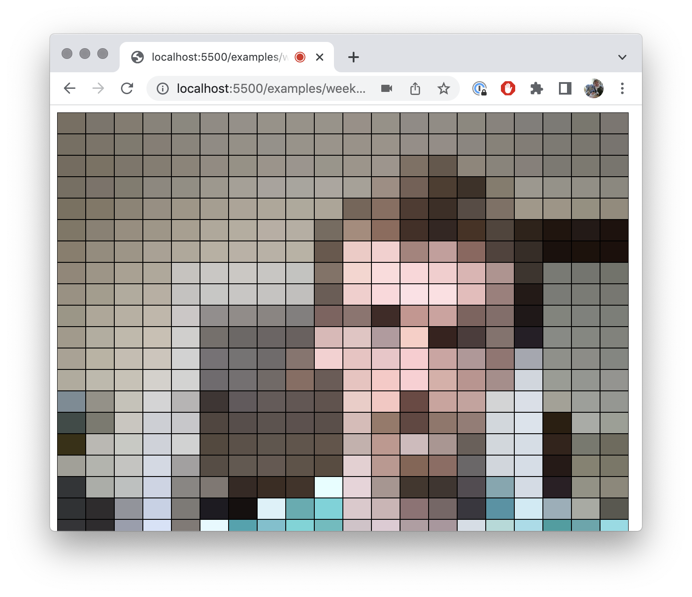

# Real Time Social Spaces

Examples for the Real-Time Social Spaces courses for NYU's Interactive Media Arts / Interactive Telecommunications Program.

Live versions of the p5 examples can be [seen here](https://editor.p5js.org/AidanNelson/collections/1cBiKD7jF).

## Examples

### Week 1

- [0 - Working with Video](./examples/week-1/0-working-with-video/) - [Live Version](https://editor.p5js.org/AidanNelson/sketches/c4F-3whey) - this sketch shows a number of ways to manipulate live video in p5.js.

- [1 - Sharing Video](./examples/week-1/1-sharing-video/) - [Live Version](https://editor.p5js.org/AidanNelson/sketches/DCKyG2eb5) - this sketch shows the basic use of the [p5LiveMedia library](https://github.com/vanevery/p5LiveMedia) to share live video feeds.

### Week 2

-
-

### Week 3

-
-

### Week 4

-
-

### Week 5

-
-
