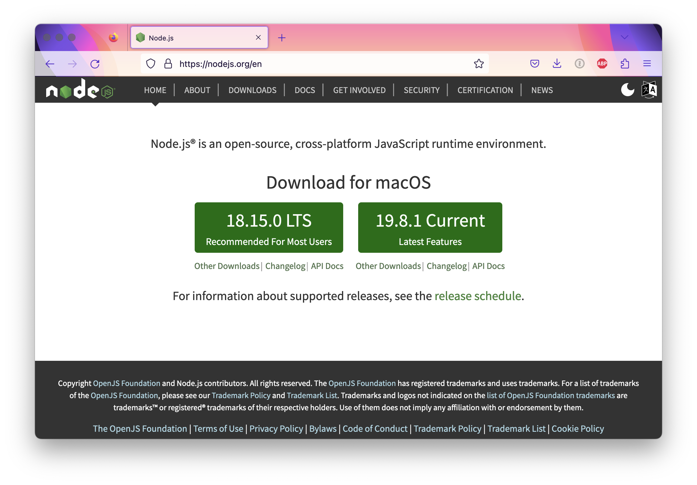
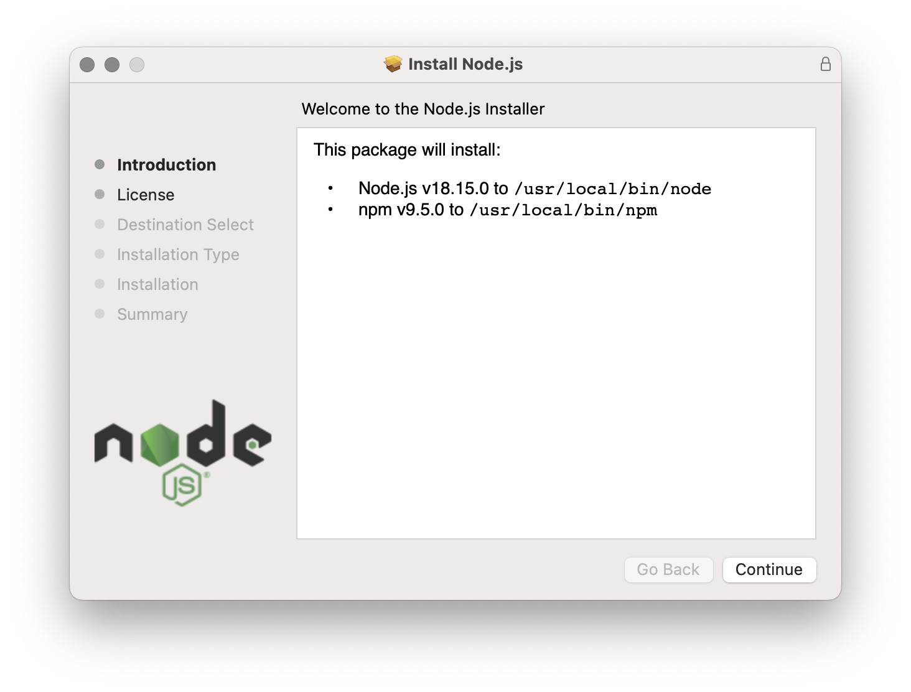
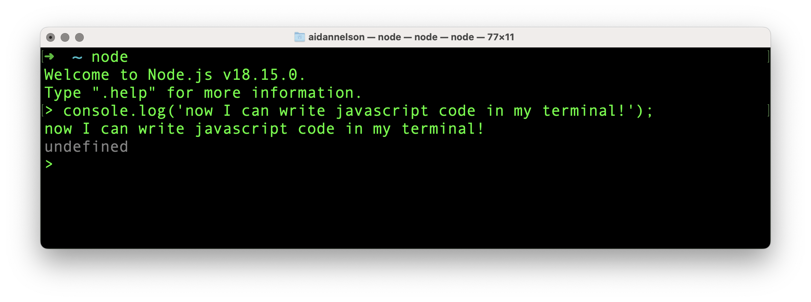

## How to install Node.js on your computer

Here we are going to install the node.js interpreter and the node package manager (npm).

1. Go to the website and download one of the long-term support (LTS) versions -- currently v.18.15.0 -- for your operating system: https://nodejs.org/en

2. Double-click on the downloaded file to start the install process.

3. Once complete, open your terminal emulator (i.e. the application "Terminal" on Mac OS) and see if the install process went through:

4. You're all done. Congratulations! 🎉
