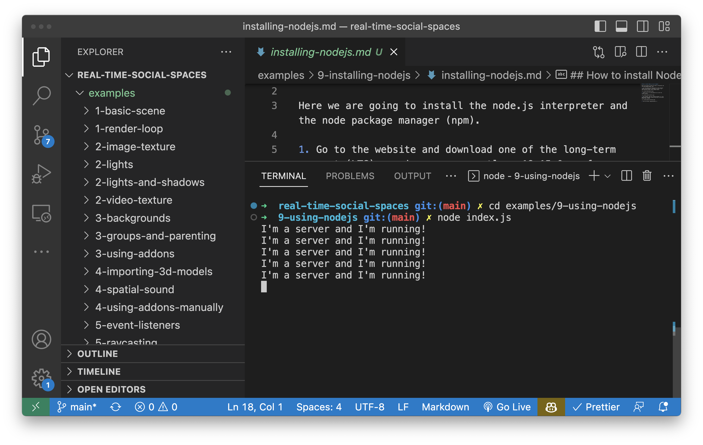

## Using Node.js on your computer

This folder (called 9-using-nodejs) contains a node.js project. In this project you will see an `index.js` file. This is our server-side code. Alongside it, you will see a `package.json` file. This contains additional information about our server (such as any libraries or dependencies this server may need).

You can start this server from the terminal built into VSCode. First, we need to open a terminal window, which you by clicking `New Terminal` under the `Terminal` menu item. Then, we need to change directory to move our terminal window into the correct folder. On Mac OS, you can do this as follows:

```sh
cd examples/9-using-nodejs
```

Finally, we can run our server using our newly installed `node` command:

```sh
node server.js
```

You should see some output like this:


You can then exit the server by pressing `CTRL + C` at the same time on your keyboard.
